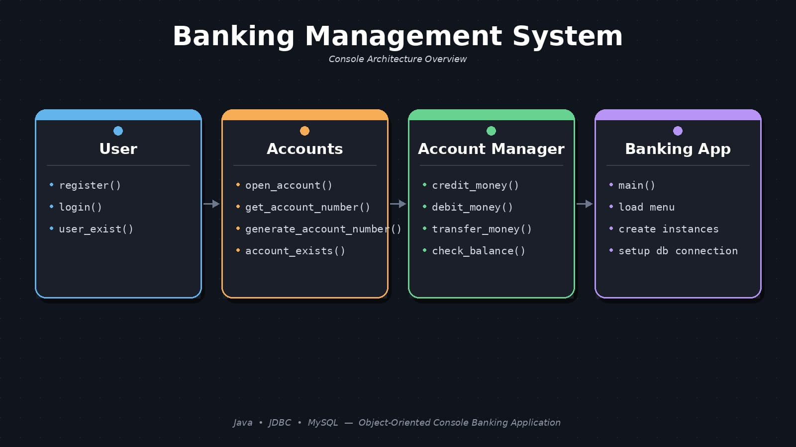
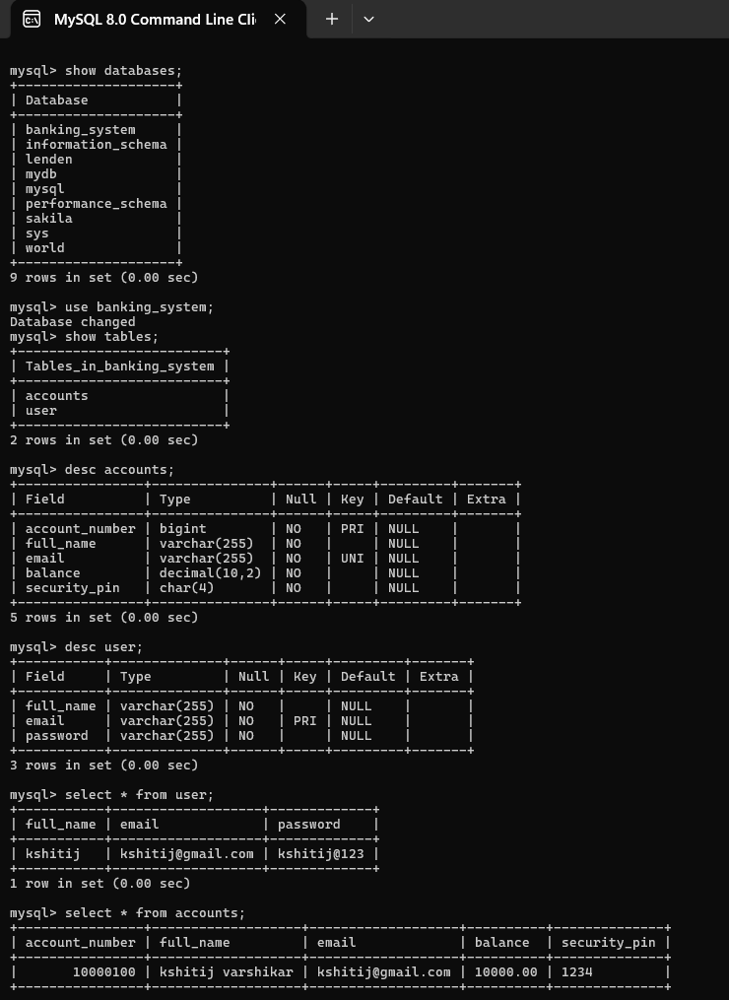
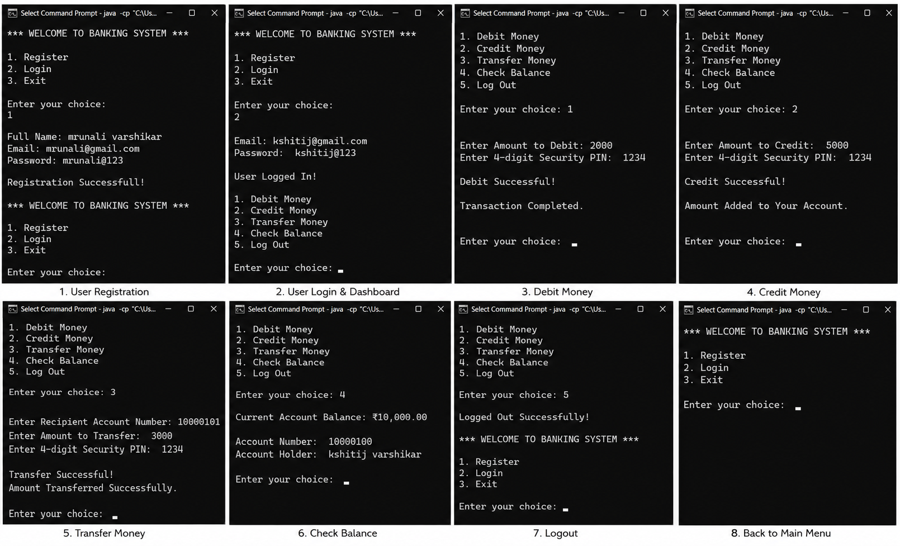

# Banking Management System

A **Console-Based Banking Management System** built using **Core Java, JDBC, and MySQL** with secure user authentication, account management, balance inquiry, debit, credit, fund transfer, and database integration following **Object-Oriented Programming (OOP)** principles.

This project demonstrates Java backend development concepts including **OOP, JDBC connectivity, MySQL database operations, exception handling, and modular programming**.

---

## 🚀 Features

- 🔐 User Registration and Login Authentication
- 👤 Account Creation and Management
- 🔢 Automatic Account Number Generation
- 💰 Balance Inquiry
- ➕ Credit Money (Deposit)
- ➖ Debit Money (Withdrawal)
- 🔄 Fund Transfer Between Accounts
- 🔍 Account Existence Verification
- 🗄️ MySQL Database Integration
- 🔌 JDBC Connectivity
- ⚙️ Object-Oriented Programming Implementation

---

## 🛠️ Technologies Used

| Technology | Purpose |
|------------|---------|
| Java | Core application development |
| JDBC | Database connectivity |
| MySQL | Database storage and management |
| IntelliJ IDEA | Development Environment |
| Git & GitHub | Version Control |

---

## 📂 Project Structure

```
Banking Management System

│
├── src
│
├── User
│   ├── register()
│   ├── login()
│   └── user_exist()
│
├── Accounts
│   ├── open_account()
│   ├── get_account_number()
│   ├── generate_account_number()
│   └── account_exists()
│
├── Account Manager
│   ├── credit_money()
│   ├── debit_money()
│   ├── transfer_money()
│   └── check_balance()
│
└── Banking App
    ├── main()
    ├── Main Menu
    ├── Create Objects
    └── Setup Database Connection
```

---

# 🏗️ System Design

The Banking Management System follows an object-oriented architecture where different classes handle different banking operations.



---

# 🗄️ Banking System Database with Sample Records

The application uses **MySQL database integration** to store and manage user and account information.

Database operations include:

- User data storage
- Account details management
- Balance updates
- Transaction processing
- Fund transfer management



---

# 🎥 Banking Management System – Console Application Demo

The demo shows the working of the console-based banking application including:

- User Registration
- Login Authentication
- Account Creation
- Balance Checking
- Credit and Debit Operations
- Fund Transfer



---

# ▶️ How to Run the Project

## 1. Clone Repository

```bash
git clone https://github.com/kshitijvarshikar/Banking-Management-System.git
```

## 2. Open Project

Open the project in **IntelliJ IDEA**.

## 3. Configure MySQL Database

- Install MySQL
- Create the required database
- Update database credentials in JDBC connection file
- Add MySQL JDBC Connector

## 4. Run Application

Run:

```bash
Main.java
```

---

# 📌 Future Enhancements

- GUI implementation using JavaFX/Swing
- Transaction history module
- Admin dashboard
- Password encryption
- Spring Boot REST API version
- Web-based banking application

---

# 📚 Learning Outcomes

Through this project, I gained practical experience in:

- Core Java Programming
- Object-Oriented Programming (OOP)
- JDBC Database Connectivity
- MySQL Integration
- Backend Application Development
- Exception Handling
- Git and GitHub Workflow

---

# 👨‍💻 Author

**Kshitij Varshikar**

B.Tech Artificial Intelligence Student

GitHub:  
https://github.com/kshitijvarshikar
